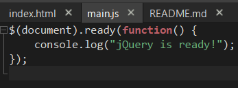
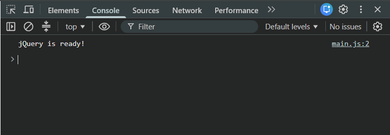
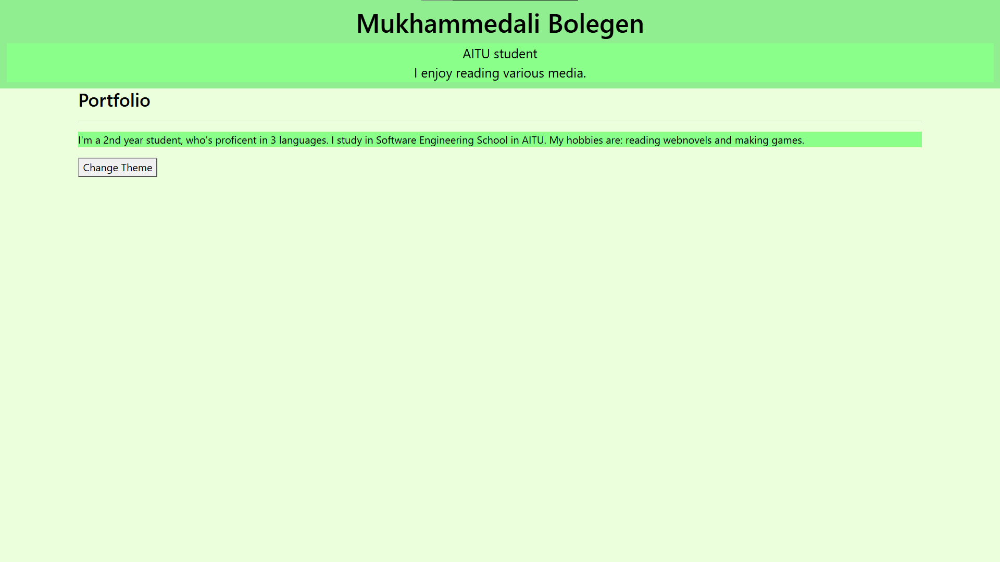
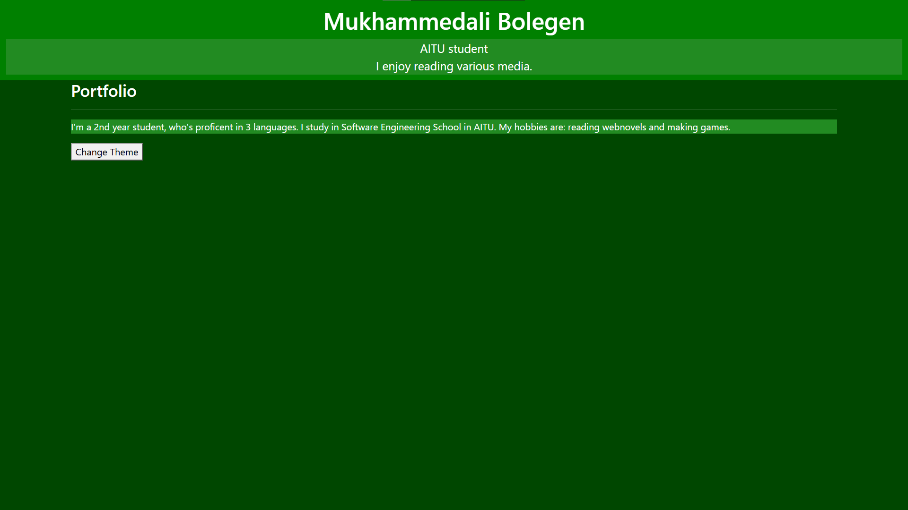
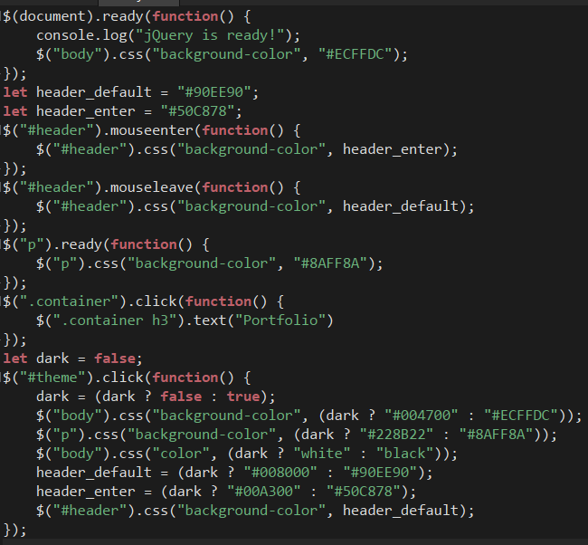
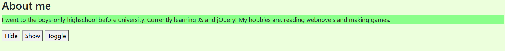
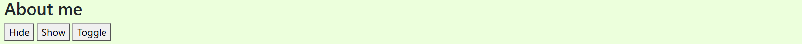
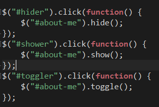

# Assignment 6: jQuery
Sixth assignment for the `Web Technologies 1` course
### Reporter
`Mukhammedali Bolegen`, `SE-2538`
## Task 0 (Setup)

I used `jQuery` to show console log message when document is fully loaded in the page.
## Task 1 (Selectors & CSS)

Used `jQuery` to select different elements and change their value.
## Task 2 (Visibility Methods)

Used `jQuery` to change visibility with buttons.
## Summary
(todo)
